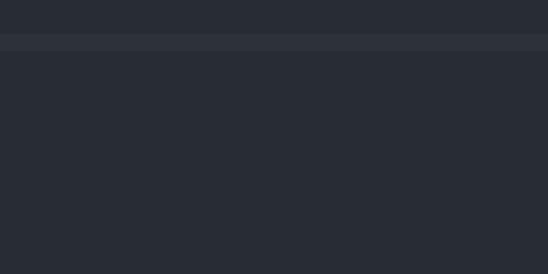

<h1 align="center">
   
    
   
  Cake PHP snippets for VS Code
   
   
</h1>

<h4 align="center">Visual Studio Code snippets code example for Cake PHP 2 & 3
</h4> 

  
  

## Demo

## Controller

| Snippet                  | Prefix       | Snippet                                   |
|--------------------------|--------------|-------------------------------------------|
| `var_dump`               | vd           | var_dump();                               |
| `debug`                  | db           | debug();                                  |
| `find`                   | find         | $this->Model->find('all');                |
| `data`                   | data         | $this->request->data                      |
| `save`                   | save         | $this->Model->save()                      |
| `pr`                     | pr           | pr();exit;                                |
| `set`                    | set          | $this->set();                             |
| `allow`                  | allow        | $this->Auth->allow()                      |
| `authenticate`           | authenticate | $this->Auth->authenticate()               |
| `deny`                   | deny         | $this->Auth->deny()                       |
| `loggedIn`               | loggedIn     | $this->Auth->loggedIn()                   |
| `login`                  | login        | $this->Auth->login()                      |
| `logout`                 | logout       | $this->Auth->logout()                     |
| `mapActions`             | mapActions   | $this->Auth->mapActions()                 |
| `redirectUrl`            | redirectUrl  | $this->Auth->redirectUrl()                |
| `flash`                  | flash        | $this->Session->flash();                  |
| `check`                  | check        | $this->Session->check();                  |
| `delete`                 | delete       | $this->Session->delete();                 |
| `destroy`                | destroy      | $this->Session->destroy();                |
| `setFlash`               | setFlash     | $this->Session->setFlash();               |
| `write`                  | write        | $this->Session->write();                  |
| `read`                   | read         | $this->Session->read();                   |
| `read`                   | read         | $this->Session->read();                   |
| `conditions`             | conditions   | 'conditions' => array('Model.id =>$id)    |
| `order`                  | order        | 'order' => array('Model.id' => 'ASC')     |
| `contain`                | conatain     | 'contain' => array('Model')               |
| `url-array`              | url          | array('controller' => '', 'action' => '') |
| `$this->request`         | request      | $this->request                            |
| `$this->redirect`        | redirect     | $this->redirect                           |
| `$this->request->params` | params       | $this->request->$params                   |
| `$this->request->query`  | query        | $this->request->query                     |

## View

| Snippet   | Prefix  | Snippet                |
|-----------|---------|------------------------|
| `create`  | create  | $this->Form->create(); |
| `end`   | end   | $this->Form->end();  |
| `input`   | input   | $this->Form->input();  |
| `inputs`   | inputs   | $this->Form->inputs();  |
| `label`   | label   | $this->Form->label();  |
| `text`   | text   | $this->Form->text();  |
| `password`   | password   | $this->Form->password();  |
| `hidden`   | hidden   | $this->Form->hidden();  |
| `textarea`   | textarea   | $this->Form->textarea();  |
| `radio`   | radio   | $this->Form->radio();  |
| `select`   | select   | $this->Form->select();  |
| `file`   | file   | $this->Form->file();  |
| `button`   | button   | $this->Form->button();  |
| `postButton`   | postButton   | $this->Form->postButton();  |
| `postLink`   | postLink   | $this->Form->postLink();  |
| `year`   | year   | $this->Form->year();  |
| `month`   | month   | $this->Form->month();  |
| `day`   | day   | $this->Form->day();  |
| `hour`   | hour   | $this->Form->hour();  |
| `meridian`   | meridian   | $this->Form->meridian();  |
| `error`   | error   | $this->Form->error();  |
| `isFieldError`   | isFieldError   | $this->Form->isFieldError();  |
| `unlockField`   | unlockField   | $this->Form->unlockField();  |
| `secure`   | secure   | $this->Form->secure();  |
| `submit`  | submit  | $this->Form->submit(); |
| `element` | element | $this->element();      |
| `link`    | clink   | $this->Html->link();   |

## View(HTML)

| Snippet   | Prefix  | Snippet                                                                                               |
|-----------|---------|-------------------------------------------------------------------------------------------------------|
| `input`   | cinput  | \<\?php echo $this->Form->input('field'); ?>                                                          |
| `create`  | create  | \<\?php echo $this->Form->create('Model'); ?>                                                         |
| `submit`  | csubmit | \<\?php echo $this->Form->submit(__(Save));  ?>                                                       |
| `element` | element | \<\?php echo $this->element('file'); ?>                                                               |
| `link`    | clink   | \<\?php echo $this->Html->link('title', array('controller' => 'controller', 'action => 'action')); ?> |

## Model

| Snippet               | Prefix     | Snippet                                                                                                                                                                                                                                                       |
|-----------------------|------------|---------------------------------------------------------------------------------------------------------------------------------------------------------------------------------------------------------------------------------------------------------------|
| `belongsTo`           | bt         | public $belongsTo = array(     &nbsp;&nbsp;'classname' => array(     &nbsp;&nbsp; 'foreignKey' => &nbsp;&nbsp;&nbsp;&nbsp;'foreign_key',     &nbsp;&nbsp;&nbsp;&nbsp;'className' => &nbsp;&nbsp;&nbsp;&nbsp;&nbsp;&nbsp;'className'   ));         |
| `hasMany`             | hm         | public $hasMany = array(   'className' => array(     'className' => 'className',     'dependent' => true   ));                                                                                                                                    |
| `hasAndBelongsToMany` | habtm      | public $hasAndBelongsToMany = array(   'className' => array(     'className' => 'className',      'joinTable' => 'join_table',     'foreignKey' =>  foreign_key',      'associationForeignKey' => ,  association_foreign_key',    )); |
| `validate`            | validate   | $this->element('file');                                                                                                                                                                                                                                       |
| `validation`          | validation | public validate = array(    'field' => array(      'rule' => 'ruleName',      'message' =>  message'    ));                                                                                                                                    |
| `actsAs`              | act        | public $actsAs = array( );                                                                                                                                                                                                                                    |
| `App::uses`           | uses       | App::uses('AppModel', 'Model');                                                                                                                                                                                                                               |

Base on [vicocamacho/cakephp-snippets](https://github.com/vicocamacho/cakephp-snippets) and [openam/SublimeCakePHP](  https://github.com/openam/SublimeCakePHP)

## License

Please read [License](LICENSE.md) for more information